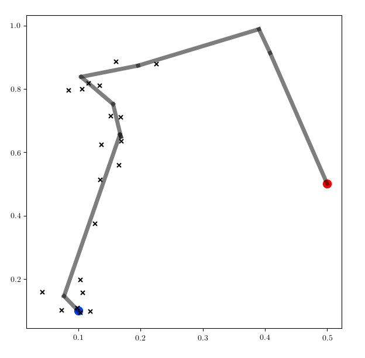

# Particle filtering in a nonlinear state space model

Here we evaluate several implementations of particle filtering in Gen as well as the particle filtering algorithm supported by Turing.
The state-space model is a hidden markov model with $N$ time steps, where the hidden states $d_i \in \mathbb{R}$ for $i=1\ldots N$ are the distances that an autonomous agent has moved along a piecewise linear path $p$ in the x-y plane at given times $t_i \ge 0$.
The corresponding observations are pairs $(x_i, y_i)$ for $i=1\ldots N$.
There is a given nominal speed $v \ge 0$, and a given variability $\sigma_d$ in distance traveled and a given measurement noise $\sigma_m$.
Specifically the model is:

- $d_1 \sim \mathcal{N}(v t_1, \sigma_d)$ and $d_i \sim \mathcal{N}(d_{i-1} + v (t_2 - t_1), \sigma_d)$ for $i=2\ldots N$.

- $x_i \sim \mathcal{N}(f_x(p, d_i), \sigma_m)$ and $y_i \sim \mathcal{N}(f_y(p, d_i), \sigma_m)$ for $i=1\ldots N$.

where $f_x(p, d)$ for path $p$ and distance $d$ is the x-coordinate of the point along the path $p$ found by walking a distance of $d$ along the path, and similarly for $f_y$.
Note that for $d$ that exceed the length of the path, $(f_x(p, d), f_y(p, d))$ is the terminal point on the path.
Note that although the dynamics model is linear-Gaussian, the measurement model is piecewise-linear Gaussian.

An example path $p$ is shown as in grey below, and an example data set of $(x_i, y_i)$ pairs are overlaid.
The first point in the path is highlighted in blue, and the terminal point is shown in red:

We evaluate two particle filtering algorithms---one that uses the dynamics as the proposal for each $d_i$ (a *generic* proposal), and one which uses a *custom* proposal that takes the measurement $(x_i, y_i)$ into account when proposing $d_i$.
The custom proposal requires some manual derivation, and requires more code to implement, but the resulting particle filter is be significantly more efficient than the particle filter with the generic proposal.
For the custom proposal, we will use the conditional distribution on $d_i$ given $d_{i-1}$ and $(x_i, y_i)$ under the generative model.
